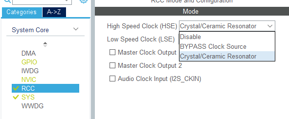
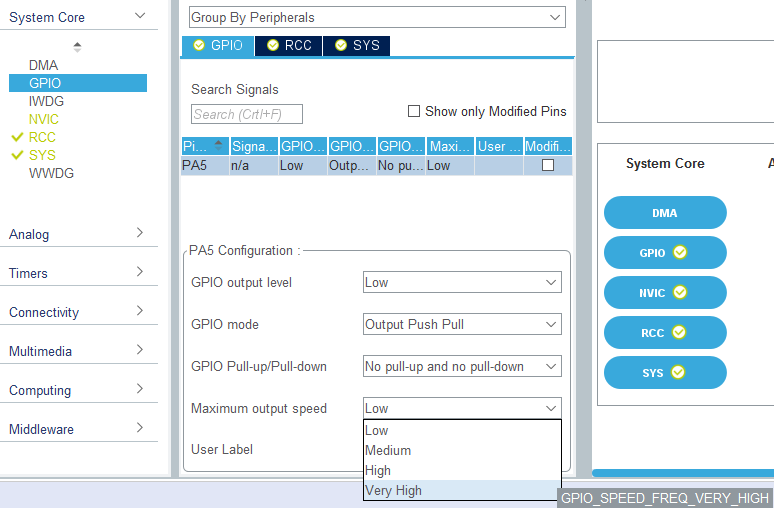

# STM32 Eğitimi - 001 GPIO Operasyonları

STM32 kartlarında giriş, çıkış işlemlerinden bahsedeceğiz. Bunun yanında yine GPIO operasyonlarına dahil olan EXTI harici kesmelere giriş yapacağız.

----------------------------

## Başlarken

##### GPIO (General-Purpose Input/Output) Nedir ?

GPIO, genel amaçlı giriş, çıkış pini anlamına gelir. Bu seçtiğiniz pinin dış bir kaynaktan +3.3V elektrik alabilir veya +3.3V elektrik iletebilir anlamına gelmektedir. Akım değeri de 10 - 20 mA olmasına dikkat ediniz. Gerekli ayrıntılar kendi işlemciniz için Başlangıç bölümünde paylaştığımız dokümanlardan edinilebilir.

##### GPIO Interrupts (Kesmeler) Nedir ?

Bir fabrikanın ürün bantlarının olduğunu düşünelim. Herhangi bir aksilik olması durumunda kocaman kırmızı butonlar bulunur. Sorun oluştuğunda bu butonlarla operasyon durdurulur ve kesme meydana gelir. Sorun düzeltildikten sonra ürün bantları tekrar kaldığı yerden itibaren çalıştırılır. Mikrodenetleyiciler içinde durum böyledir. Kesme işlemi gerçekleştiğinde bütün işi durdurup, kesme içerisindeki kodlar çalıştırılır. Kesme kodları bittikten sonra döngü içerisinde kaldığı yere gelip, kodlarını çalıştırmaya devam eder. Kesmeleri butonlar yardımıyla da tetikleyebiliriz.

---

## GPIO CubeMX Ayarları

Başlangıç dokümanınında temel bir proje oluşturmayı görmüştük. Tekrar aynı yöntemi izleyerek yeni bir proje oluşturalım. Bu sefer harici osilatörümüzü bağlayacağız. İlk başta HSE osilatörümüzü aktif etmek için **System Core --> RCC --> HSE --> Cyristal/Ceramic Resonator** seçeneğini aktif ediyoruz. İlgili pinlerin yeşile döndüğünü ve aktif olduğunu görmüşsünüzdür.



Her ne kadar aktif etmesek bile kendi otomatik aktif etse de bu seçeneği de göstermek istiyorum. Mikrodenetleyicinin bilgisayarla bağlantı kurup, çalıştıracağı kodları alabilmesi için **System Core --> SYS --> Debug --> Serial Wire** kısmını seçebilirsiniz. Tekrar bahsettiğim gibi sistem seçmeseniz bile otomatik olarak aktif ediyor. Başka sistemler kullandığınız zaman normalde bunu da aktif ettiğinizi bilmeniz için bu konuya değindim.


Stm32f446re kartımda bir adet kullanıcıya bırakılmış led bulunmaktadır. Benim bu ledim PA_5 piniyle bağlantılı olduğu için PA5 pinine güç çıkışı verdiğim zaman bu led yanacaktır. Sizin kullandığınız mikrodenetleyici de farklı bir pine bağlı olabileceği için mutlaka datasheetine bakmanızı öneririm. İlgili led pinini bulduktan sonra **GPIO_Output** seçeneğini seçin. Yeşil döndüğünü ve tekrar tıkladığınızda GPIO_Output seçeneğinin aktif olduğunu göreceksiniz.


Yine System Core içerisinden GPIO'ya tıklayarak ilgili pinlerimizi listeleyebiliriz. Ben bir tane pini aktif ettiğim için sadece **PA5** pinim görünmektedir. Burda sadece hız kısmını en yüksek hız olarak değiştiriyorum, diğer genel ayarlarını olduğu gibi kullanıyorum. Bataryadan güç almadığımız için güç tüketimine dikkat etmemize gerek yok.



Şimdi **Clock Configuration** sekmesine geçelim ve **HSE** seçeneğini, **PLLCLK** seçeneği seçip, maksimum hızımız kaçsa mikrodenetleyicimizi o hızda çalıştıralım. Gücü bilgisayardan alacağımız için ve batarya derdimiz olmadığından istediğimiz hızı seçebiliriz. İsterseniz farklı bir değerde girebilirsiniz, PLL ve ilgili diğer ayarları CubeMX sizin için ayarlayacaktır. Benim kartımın en fazla ulaşabileceği değer 180 MHz olduğu için onu seçiyorum.


Artık **Ctrl + S** veya üstteki Generate Code seçeneğiyle kodlarımızı derleyebiliriz. Şimdi **main.c** dosyasını açalım ve Led Yakma projemize geçelim.

---

## GPIO Led Yakma (Led Blink)

Projemizi açarak, **Core --> Src --> main.c** yoluyla dosyamızı açıyoruz. Sürekli tekrar etmek istediğimiz için `**while(1){**` 'den hemen sonra yazıyoruz. Kısayolu `Ctrl + Shift + F` olan tuş kombinasyonu ile kodların satırlarını düzenli bir hale getirebiliriz. `HAL_GPIO_WritePin(GPIOA, GPIO_PIN_5, GPIO_PIN_SET);` komutu **A portundaki,** 5 numaralı pini, **SET** eder.Yani; ledimizi yakar. `HAL_Delay(1000)` komutu ise **1000 ms** yani 1 saniye bekler. Tekrar WritePin ile `GPIO_PIN_RESET` ayarını değiştirerek ledimizi söndürüyoruz ve yine 1 sn bekliyoruz.
> **UYARI :** Dikkat etmemiz gerek husus, ileride tekrar **CubeMX** kullanma ihtimalimize veya yeni özellikler eklememize karşın kodlarımızı **USER CODE BEGIN/END** yazan yerlerin arasına yazmamızdır. **CubeMX**'de tekrar **Generate Code** seçeneğini kullandığımızda bizim yazdığımız kodlara dokunmaz fakat belirtilen yerlere yazmak isek oradaki **TÜM KODLAR SİLİNİR.**


Alternatif olarak **WritePin** yerine **TogglePin** ile de aynı işlemi yapabilirdik. TogglePin ise mevcut `Low(0)` veya `High(1)` durumunu tam tersi şekilde işleme koyar. Hatırlarsanız en başta CubeMX'de **PA5** pinimizi **LOW(0)** olarak ayarlamıştık.

```c

	/* USER CODE BEGIN WHILE */
	while (1) {
		HAL_GPIO_TogglePin(GPIOA, GPIO_PIN_5, GPIO_PIN_SET);
		HAL_Delay(1000);
		/* USER CODE END WHILE */

		/* USER CODE BEGIN 3 */
	}
	/* USER CODE END 3 */

```

---

**MIT Lisansı**

[Telif Hakkı (Copyright)](https://github.com/w3eydi/STM32-Egitimi/blob/master/LICENSE) (c) 2020 Eydi Gözeneli - github.com/w3eydi